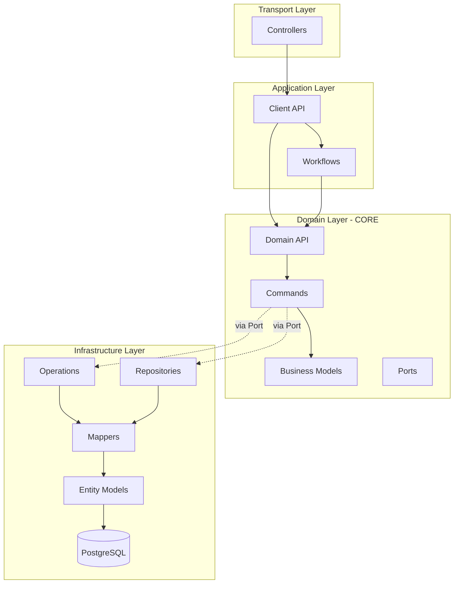
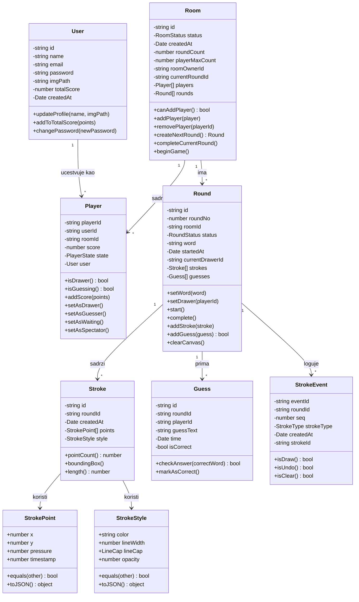
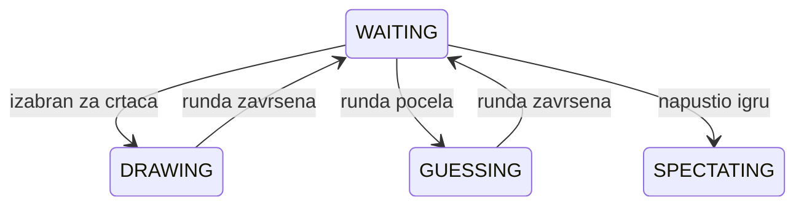
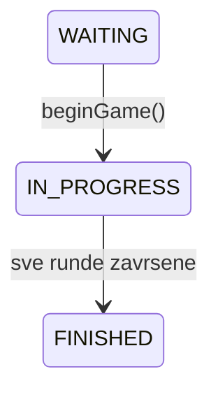
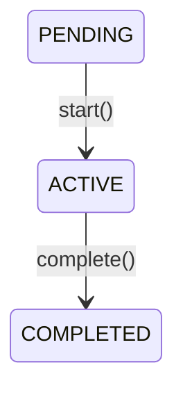
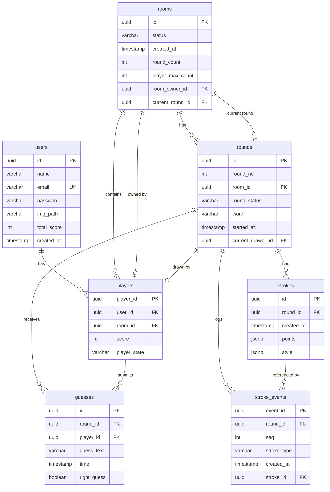
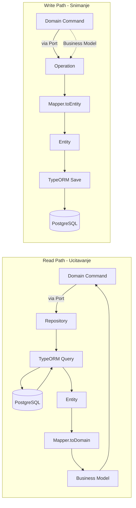
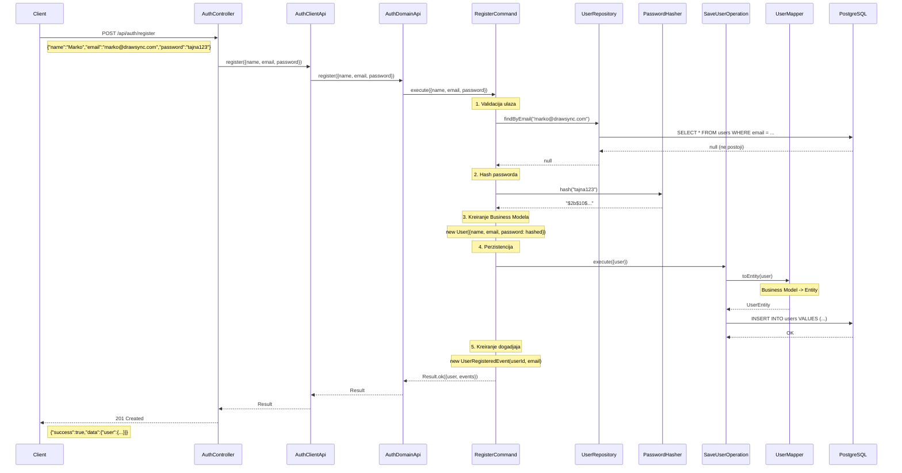
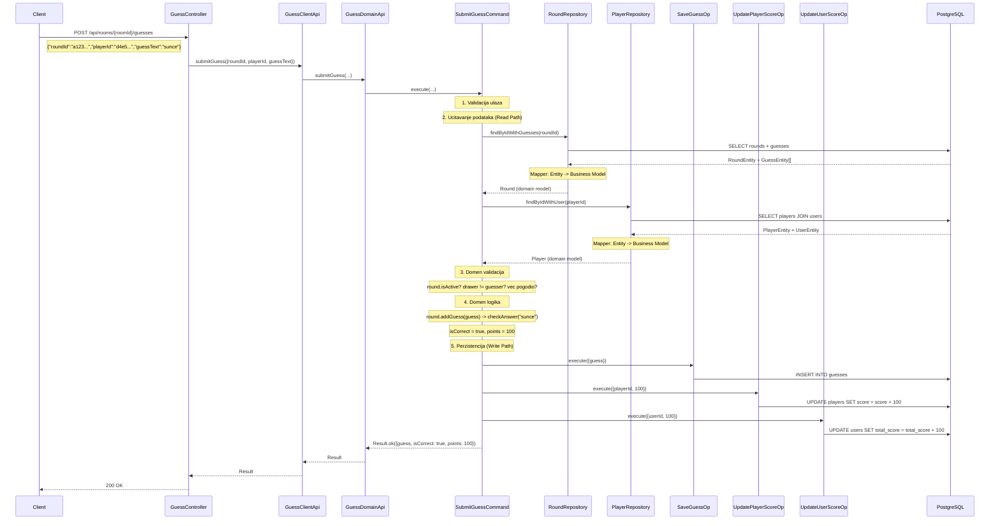

# Faza II -- Business Model, Entity Model i Data Layer biblioteka

> **Projekat:** DrawSync -- Real-time multiplayer drawing game  
> **Modul:** Backend (NestJS / TypeScript)  
> **Repozitorijum:** `Aplikacija/backend/src/`

---

## Sadrzaj

1. [Uvod](#1-uvod)
2. [Business Model (Domain Model)](#2-business-model-domain-model)
3. [Entity Model (Persistence Model)](#3-entity-model-persistence-model)
4. [Mapiranje Business Modela u Entity Model](#4-mapiranje-business-modela-u-entity-model)
5. [Data Layer biblioteka](#5-data-layer-biblioteka)
6. [End-to-End Flow primeri](#6-end-to-end-flow-primeri)
7. [Dependency Injection i Module Wiring](#7-dependency-injection-i-module-wiring)

---

## 1. Uvod

### 1.1 Namena dokumenta

Ovaj dokument opisuje:

- **Business Model** -- domenski model podataka sa svim entitetima, vrednosnim objektima i poslovnim pravilima
- **Entity Model** -- model perzistencije (baza podataka) sa tabelama, kolonama, ogranicenjima i relacijama
- **Data Layer biblioteka** -- implementaciju funkcija za snimanje i ucitavanje business modela, uklucujuci mapiranje izmedju dva modela

### 1.2 Arhitekturni kontekst

Backend koristi **Onion / Clean Architecture** sa **Ports & Adapters** obrascem:



**Pravilo zavisnosti:** Zavisnosti uvek pokazuju ka unutra. Domenski sloj nikada ne zavisi od infrastrukture. Komunikacija sa infrastrukturom odvija se iskljucivo preko **Port** interfejsa koje domenski sloj definise, a infrastruktura implementira.

---

## 2. Business Model (Domain Model)

Business model se nalazi u `backend/src/domain/models/` i predstavlja logicke entitete igre, nezavisne od baze podataka i infrastrukture.

### 2.1 Dijagram klasa



### 2.2 Opisi entiteta

#### User

| Atribut | Tip | Opis |
|---------|-----|------|
| `id` | `string (UUID)` | Jedinstveni identifikator korisnika |
| `name` | `string` | Ime za prikaz (min 2 karaktera) |
| `email` | `string` | Email adresa (unique) |
| `password` | `string` | Hashovan password (bcrypt) |
| `imgPath` | `string \| null` | Putanja do profilne slike |
| `totalScore` | `number` | Ukupan score kroz sve igre |
| `createdAt` | `Date` | Datum registracije |

**Metode:** `updateProfile()` -- azurira ime i sliku uz validaciju. `addToTotalScore(points)` -- dodaje bodove (ne dozvoljava negativne). `changePassword()` -- menja sifru (min 6 karaktera).

**Lokacija:** `domain/models/user.model.ts`

---

#### Player

| Atribut | Tip | Opis |
|---------|-----|------|
| `playerId` | `string (UUID)` | Jedinstveni ID igraca u sobi |
| `userId` | `string (UUID)` | Referenca na User |
| `roomId` | `string (UUID)` | Referenca na Room |
| `score` | `number` | Bodovi u trenutnoj partiji |
| `state` | `PlayerState` | Trenutno stanje igraca |
| `user` | `User \| undefined` | Opcionalni ucitani User objekat |

**Stanja (PlayerState enum):**



- `WAITING` -- ceka na pocetak runde
- `DRAWING` -- trenutno crta
- `GUESSING` -- pogadja rec
- `SPECTATING` -- posmatra

**Lokacija:** `domain/models/player.model.ts`

---

#### Room

| Atribut | Tip | Opis |
|---------|-----|------|
| `id` | `string (UUID)` | Jedinstveni ID sobe |
| `status` | `RoomStatus` | Status igre |
| `createdAt` | `Date` | Vreme kreiranja |
| `roundCount` | `number` | Ukupan broj rundi (1-10) |
| `playerMaxCount` | `number` | Maksimalan broj igraca (2-16) |
| `roomOwnerId` | `string` | ID igraca koji je vlasnik sobe |
| `currentRoundId` | `string \| null` | ID aktivne runde |
| `players` | `Player[]` | Lista igraca |
| `rounds` | `Round[]` | Lista rundi |

**Status (RoomStatus enum):**



**Poslovna pravila:**
- Soba je puna kada `players.length >= playerMaxCount`
- Novi igraci mogu da se prikljuce samo u `WAITING` statusu
- Prvi igrac automatski postaje vlasnik (`roomOwnerId`)
- Kada vlasnik napusti sobu, vlasnistvo se prenosi na sledeceg igraca
- Igra zahteva minimum 2 igraca za pocetak
- Crtac se bira round-robin algoritmom (`(roundNo - 1) % players.length`)

**Lokacija:** `domain/models/room.model.ts`

---

#### Round

| Atribut | Tip | Opis |
|---------|-----|------|
| `id` | `string (UUID)` | Jedinstveni ID runde |
| `roundNo` | `number` | Redni broj runde |
| `roomId` | `string (UUID)` | Referenca na Room |
| `status` | `RoundStatus` | Status runde |
| `word` | `string` | Tajna rec za crtanje |
| `startedAt` | `Date` | Vreme pocetka |
| `currentDrawerId` | `string \| null` | ID igraca koji crta |
| `strokes` | `Stroke[]` | Potezi na canvasu |
| `guesses` | `Guess[]` | Pokusaji pogodaka |

**Status (RoundStatus enum):**



**Poslovna pravila:**
- Rec (`word`) mora biti postavljena pre pokretanja runde (min 2 karaktera)
- Crtac (`currentDrawerId`) mora biti dodeljen pre pokretanja
- Potezi (`addStroke`) i pogoci (`addGuess`) dozvoljeni samo tokom `ACTIVE` statusa
- Crtac ne moze da pogadja svoju rec
- Igrac koji je vec tacno pogodio ne moze ponovo da pogadja

**Lokacija:** `domain/models/round.model.ts`

---

#### Stroke

| Atribut | Tip | Opis |
|---------|-----|------|
| `id` | `string (UUID)` | Jedinstveni ID poteza |
| `roundId` | `string (UUID)` | Referenca na Round |
| `createdAt` | `Date` | Vreme kreiranja |
| `points` | `StrokePoint[]` | Niz tacaka putanje (immutable) |
| `style` | `StrokeStyle` | Vizuelni stil poteza |

**Izvedeni atributi:** `pointCount`, `boundingBox`, `length` (geometrijska duzina putanje).

**Lokacija:** `domain/models/stroke.model.ts`

---

#### Guess

| Atribut | Tip | Opis |
|---------|-----|------|
| `id` | `string (UUID)` | Jedinstveni ID pogodka |
| `roundId` | `string (UUID)` | Referenca na Round |
| `playerId` | `string (UUID)` | Referenca na Player |
| `guessText` | `string` | Tekst pogodka (lowercase, trimmed) |
| `time` | `Date` | Vreme slanja |
| `isCorrect` | `boolean` | Da li je pogodak tacan |

**Metode:** `checkAnswer(correctWord)` -- poredi sa tacnom recju (case-insensitive).

**Lokacija:** `domain/models/guess.model.ts`

---

#### StrokeEvent

| Atribut | Tip | Opis |
|---------|-----|------|
| `eventId` | `string (UUID)` | Jedinstveni ID eventa |
| `roundId` | `string (UUID)` | Referenca na Round |
| `seq` | `number` | Redni broj u sekvenci |
| `strokeType` | `StrokeType` | Tip operacije |
| `createdAt` | `Date` | Vreme kreiranja |
| `strokeId` | `string \| null` | Referenca na Stroke (nullable) |

**StrokeType enum:** `DRAW`, `ERASE`, `CLEAR`, `UNDO`

StrokeEvent je **event log** za event sourcing -- autoritativan zapis koji omogucava replay i rekonstrukciju canvasa.

**Lokacija:** `domain/models/stroke-event.model.ts`

---

### 2.3 Vrednosni objekti (Value Objects)

Value Objects su immutable (zamrznuti sa `Object.freeze`) i porede se po vrednosti, ne po referenci.

#### StrokePoint

| Atribut | Tip | Default | Opis |
|---------|-----|---------|------|
| `x` | `number` | -- | X koordinata |
| `y` | `number` | -- | Y koordinata |
| `pressure` | `number` | `1` | Pritisak olovke (0-1) |
| `timestamp` | `number` | `Date.now()` | Vremenska oznaka |

Podrzava `equals()`, `toJSON()` i `fromJSON()` za serijalizaciju.

**Lokacija:** `domain/value-objects/stroke-point.vo.ts`

#### StrokeStyle

| Atribut | Tip | Default | Opis |
|---------|-----|---------|------|
| `color` | `string` | -- | Boja (hex ili rgb format, validiran) |
| `lineWidth` | `number` | -- | Sirina linije (1-100, validirano) |
| `lineCap` | `LineCap` | `'round'` | Oblik vrha (`round`, `square`, `butt`) |
| `opacity` | `number` | `1` | Providnost (0-1) |

Validacija u konstruktoru: boja mora biti validan hex (`#RRGGBB`) ili `rgb()` format. Sirina mora biti izmedju 0 i 100.

**Lokacija:** `domain/value-objects/stroke-style.vo.ts`

---

### 2.4 Relacije izmedju modela

| Relacija | Kardinalnost | Opis |
|----------|-------------|------|
| User -> Player | 1 : N | Korisnik moze ucestvovati u vise soba istovremeno |
| Room -> Player | 1 : N | Soba sadrzi vise igraca |
| Room -> Round | 1 : N | Soba ima vise rundi |
| Round -> Stroke | 1 : N | Runda sadrzi vise poteza |
| Round -> Guess | 1 : N | Runda prima vise pogodaka |
| Round -> StrokeEvent | 1 : N | Runda loguje vise stroke evenata |
| Player -> Guess | 1 : N | Igrac moze imati vise pogodaka |

---

## 3. Entity Model (Persistence Model)

Entity model se nalazi u `backend/src/infrastructure/database/entities/` i predstavlja strukturu PostgreSQL baze podataka implementiranu putem TypeORM dekoratora.

### 3.1 ER dijagram



### 3.2 Opisi tabela

#### users

| Kolona | Tip | Ogranicenja | Opis |
|--------|-----|-------------|------|
| `id` | `UUID` | PK | Primarni kljuc |
| `name` | `VARCHAR(100)` | NOT NULL | Ime korisnika |
| `email` | `VARCHAR(255)` | NOT NULL, UNIQUE | Email adresa |
| `password` | `VARCHAR(255)` | NOT NULL | Hashovan password |
| `img_path` | `VARCHAR(500)` | NULLABLE | Putanja do slike |
| `total_score` | `INT` | DEFAULT 0 | Ukupan score |
| `created_at` | `TIMESTAMP` | DEFAULT now() | Datum kreiranja |

**Entitet:** `UserEntity` u `database/entities/user.entity.ts`

---

#### rooms

| Kolona | Tip | Ogranicenja | Opis |
|--------|-----|-------------|------|
| `id` | `UUID` | PK | Primarni kljuc |
| `status` | `VARCHAR(20)` | DEFAULT 'WAITING' | Status sobe |
| `created_at` | `TIMESTAMP` | DEFAULT now() | Datum kreiranja |
| `round_count` | `INT` | DEFAULT 3 | Broj rundi |
| `player_max_count` | `INT` | DEFAULT 8 | Maksimum igraca |
| `room_owner_id` | `UUID` | FK -> players, NULLABLE | Vlasnik sobe |
| `current_round_id` | `UUID` | FK -> rounds, NULLABLE | Aktivna runda |

**Napomena:** `room_owner_id` i `current_round_id` su cirkularne FK relacije -- dodaju se sa `ALTER TABLE` nakon kreiranja zavisnih tabela.

**Indeksi:** `IDX_rooms_status` na `status` koloni.

**Entitet:** `RoomEntity` u `database/entities/room.entity.ts`

---

#### players

| Kolona | Tip | Ogranicenja | Opis |
|--------|-----|-------------|------|
| `player_id` | `UUID` | PK | Primarni kljuc |
| `user_id` | `UUID` | FK -> users, CASCADE | Referenca na korisnika |
| `room_id` | `UUID` | FK -> rooms, CASCADE | Referenca na sobu |
| `score` | `INT` | DEFAULT 0 | Score u partiji |
| `player_state` | `VARCHAR(20)` | DEFAULT 'WAITING' | Stanje igraca |

**Indeksi:** `IDX_players_user` na `user_id`, `IDX_players_room` na `room_id`.

**Entitet:** `PlayerEntity` u `database/entities/player.entity.ts`

---

#### rounds

| Kolona | Tip | Ogranicenja | Opis |
|--------|-----|-------------|------|
| `id` | `UUID` | PK | Primarni kljuc |
| `round_no` | `INT` | NOT NULL | Redni broj runde |
| `room_id` | `UUID` | FK -> rooms, CASCADE | Referenca na sobu |
| `round_status` | `VARCHAR(20)` | DEFAULT 'PENDING' | Status runde |
| `word` | `VARCHAR(100)` | DEFAULT '' | Tajna rec |
| `started_at` | `TIMESTAMP` | NULLABLE | Vreme pocetka |
| `current_drawer_id` | `UUID` | FK -> players, SET NULL | Trenutni crtac |

**Indeksi:** `IDX_rounds_room` na `room_id`.

**Entitet:** `RoundEntity` u `database/entities/round.entity.ts`

---

#### strokes

| Kolona | Tip | Ogranicenja | Opis |
|--------|-----|-------------|------|
| `id` | `UUID` | PK | Primarni kljuc |
| `round_id` | `UUID` | FK -> rounds, CASCADE | Referenca na rundu |
| `created_at` | `TIMESTAMP` | DEFAULT now() | Vreme kreiranja |
| `points` | `JSONB` | NOT NULL | Niz tacaka poteza |
| `style` | `JSONB` | NOT NULL | Vizuelni stil poteza |

**JSONB format za `points`:**
```json
[
  {"x": 100, "y": 200, "pressure": 0.5, "timestamp": 1707600000},
  {"x": 120, "y": 210, "pressure": 0.7, "timestamp": 1707600016}
]
```

**JSONB format za `style`:**
```json
{"color": "#FF5733", "lineWidth": 4, "lineCap": "round", "opacity": 1.0}
```

**Indeksi:** `IDX_strokes_round` na `round_id`.

**Entitet:** `StrokeEntity` u `database/entities/stroke.entity.ts`

---

#### stroke_events

| Kolona | Tip | Ogranicenja | Opis |
|--------|-----|-------------|------|
| `event_id` | `UUID` | PK | Primarni kljuc |
| `round_id` | `UUID` | FK -> rounds, CASCADE | Referenca na rundu |
| `seq` | `INT` | NOT NULL | Redni broj u sekvenci |
| `stroke_type` | `VARCHAR(20)` | NOT NULL | Tip operacije |
| `created_at` | `TIMESTAMP` | DEFAULT now() | Vreme kreiranja |
| `stroke_id` | `UUID` | FK -> strokes, SET NULL, NULLABLE | Referenca na potez |

**Indeksi:** `IDX_stroke_events_round` na `round_id`, `IDX_stroke_events_seq` kompozitni na `(round_id, seq)`.

**Napomena:** Ova tabela je **autoritativan izvor istine** za replay -- eventi se obradjuju sekvencijalno po `seq` broju.

**Entitet:** `StrokeEventEntity` u `database/entities/stroke-event.entity.ts`

---

#### guesses

| Kolona | Tip | Ogranicenja | Opis |
|--------|-----|-------------|------|
| `id` | `UUID` | PK | Primarni kljuc |
| `round_id` | `UUID` | FK -> rounds, CASCADE | Referenca na rundu |
| `player_id` | `UUID` | FK -> players, CASCADE | Referenca na igraca |
| `guess_text` | `VARCHAR(255)` | NOT NULL | Tekst pogodka |
| `time` | `TIMESTAMP` | NOT NULL | Vreme slanja |
| `right_guess` | `BOOLEAN` | DEFAULT false | Da li je tacan |

**Indeksi:** `IDX_guesses_round` na `round_id`.

**Entitet:** `GuessEntity` u `database/entities/guess.entity.ts`

---

### 3.3 Migracija

Inicijalna shema je definisana u migracionom fajlu `database/migrations/1706900000000-InitialSchema.ts`. Migracija kreira tabele odgovarajucim redosledom da bi se zadovoljile FK zavisnosti, i dodaje cirkularne FK relacije putem `ALTER TABLE` naredbi naknadno.

---

## 4. Mapiranje Business Modela u Entity Model

Mapiranje se vrsi putem **Data Mapper** klasa u `backend/src/infrastructure/mappers/`. Svaki mapper nasledjuje `BaseMapper<DomainModel, Entity>` i implementira dve metode:
- `toDomain(entity)` -- konvertuje Entity iz baze u Business Model
- `toEntity(domain)` -- konvertuje Business Model u Entity za cuvanje

### 4.1 Pregled mapiranja po modelu

#### User <-> UserEntity

| Business Model (User) | Entity (UserEntity) | Napomena |
|----------------------|---------------------|----------|
| `id` | `id` | Direktno |
| `name` | `name` | Direktno |
| `email` | `email` | Direktno |
| `password` | `password` | Direktno (hashovan) |
| `imgPath` | `imgPath` (kolona `img_path`) | snake_case u bazi |
| `totalScore` | `totalScore` (kolona `total_score`) | snake_case u bazi |
| `createdAt` | `createdAt` (kolona `created_at`) | snake_case u bazi |

**Mapper:** `UserMapper` u `mappers/user.mapper.ts`

```typescript
// toDomain: Entity -> Business Model
toDomain(entity: UserEntity): User {
  return new User({
    id: entity.id,
    name: entity.name,
    email: entity.email,
    password: entity.password,
    imgPath: entity.imgPath,
    totalScore: entity.totalScore,
    createdAt: entity.createdAt
  });
}

// toEntity: Business Model -> Entity
toEntity(domain: User): UserEntity {
  const entity = new UserEntity();
  entity.id = domain.id;
  entity.name = domain.name;
  entity.email = domain.email;
  entity.password = domain.password;
  entity.imgPath = domain.imgPath;
  entity.totalScore = domain.totalScore;
  entity.createdAt = domain.createdAt;
  return entity;
}
```

---

#### Player <-> PlayerEntity

| Business Model (Player) | Entity (PlayerEntity) | Napomena |
|------------------------|----------------------|----------|
| `playerId` | `playerId` (kolona `player_id`) | Direktno |
| `userId` | `userId` (kolona `user_id`) | Direktno |
| `roomId` | `roomId` (kolona `room_id`) | Direktno |
| `score` | `score` | Direktno |
| `state` (PlayerState enum) | `playerState` (kolona `player_state`, VARCHAR) | Enum -> String |
| `user` (User objekat) | `user` (UserEntity relacija) | Mapira se rekurzivno preko UserMapper |

**Mapper:** `PlayerMapper` u `mappers/player.mapper.ts`

```typescript
toDomain(entity: PlayerEntity): Player {
  return new Player({
    playerId: entity.playerId,
    userId: entity.userId,
    roomId: entity.roomId,
    score: entity.score,
    state: entity.playerState as PlayerState,  // string -> enum cast
    user: entity.user ? this.userMapper.toDomain(entity.user) : undefined
  });
}
```

---

#### Room <-> RoomEntity

| Business Model (Room) | Entity (RoomEntity) | Napomena |
|----------------------|---------------------|----------|
| `id` | `id` | Direktno |
| `status` (RoomStatus enum) | `status` (VARCHAR) | Enum -> String |
| `roundCount` | `roundCount` (kolona `round_count`) | Direktno |
| `playerMaxCount` | `playerMaxCount` (kolona `player_max_count`) | Direktno |
| `roomOwnerId` | `roomOwnerId` (kolona `room_owner_id`) | Direktno |
| `currentRoundId` | `currentRoundId` (kolona `current_round_id`) | Direktno |
| `players` (Player[]) | `players` (PlayerEntity[] relacija) | Mapiraju se rekurzivno |
| `rounds` (Round[]) | `rounds` (RoundEntity[] relacija) | Mapiraju se rekurzivno |

**Mapper:** `RoomMapper` u `mappers/room.mapper.ts`

```typescript
toDomain(entity: RoomEntity): Room {
  const room = new Room({
    id: entity.id,
    status: entity.status as RoomStatus,
    createdAt: entity.createdAt,
    roundCount: entity.roundCount,
    playerMaxCount: entity.playerMaxCount,
    roomOwnerId: entity.roomOwnerId ? entity.roomOwnerId : undefined,
    currentRoundId: entity.currentRoundId
  });
  if (entity.players) {
    room.setPlayers(this.playerMapper.toDomainList(entity.players));
  }
  if (entity.rounds) {
    room.setRounds(this.roundMapper.toDomainList(entity.rounds));
  }
  return room;
}
```

---

#### Guess <-> GuessEntity

| Business Model (Guess) | Entity (GuessEntity) | Napomena |
|-----------------------|---------------------|----------|
| `id` | `id` | Direktno |
| `roundId` | `roundId` (kolona `round_id`) | Direktno |
| `playerId` | `playerId` (kolona `player_id`) | Direktno |
| `guessText` | `guessText` (kolona `guess_text`) | Direktno |
| `time` | `time` | Direktno |
| **`isCorrect`** | **`rightGuess`** (kolona `right_guess`) | **Razlicito ime** |

**Mapper:** `GuessMapper` u `mappers/guess.mapper.ts`

```typescript
toDomain(entity: GuessEntity): Guess {
  return new Guess({
    id: entity.id,
    roundId: entity.roundId,
    playerId: entity.playerId,
    guessText: entity.guessText,
    time: entity.time,
    isCorrect: entity.rightGuess  // rightGuess -> isCorrect
  });
}

toEntity(domain: Guess): GuessEntity {
  const entity = new GuessEntity();
  entity.id = domain.id;
  entity.roundId = domain.roundId;
  entity.playerId = domain.playerId;
  entity.guessText = domain.guessText;
  entity.time = domain.time;
  entity.rightGuess = domain.isCorrect;  // isCorrect -> rightGuess
  return entity;
}
```

---

#### Stroke <-> StrokeEntity (JSONB mapiranje)

| Business Model (Stroke) | Entity (StrokeEntity) | Napomena |
|------------------------|----------------------|----------|
| `id` | `id` | Direktno |
| `roundId` | `roundId` (kolona `round_id`) | Direktno |
| `createdAt` | `createdAt` (kolona `created_at`) | Direktno |
| `points` (StrokePoint[]) | `points` (JSONB) | **Value Objects -> JSON** |
| `style` (StrokeStyle) | `style` (JSONB) | **Value Object -> JSON** |

Ovo je najslozeniji mapper jer konvertuje **Value Objects** u/iz **JSONB** formata:

**Mapper:** `StrokeMapper` u `mappers/stroke.mapper.ts`

```typescript
toDomain(entity: StrokeEntity): Stroke {
  // JSONB -> Value Objects
  const points = (entity.points as any[]).map(
    (p) => new StrokePoint({
      x: p.x, y: p.y, pressure: p.pressure, timestamp: p.timestamp
    })
  );
  const styleData = entity.style as any;
  const style = new StrokeStyle({
    color: styleData.color,
    lineWidth: styleData.lineWidth,
    lineCap: styleData.lineCap,
    opacity: styleData.opacity
  });

  return new Stroke({ id: entity.id, roundId: entity.roundId,
    createdAt: entity.createdAt, points, style });
}

toEntity(domain: Stroke): StrokeEntity {
  const entity = new StrokeEntity();
  entity.id = domain.id;
  entity.roundId = domain.roundId;
  entity.createdAt = domain.createdAt;
  // Value Objects -> JSON (koristi toJSON() metode)
  entity.points = domain.points.map((p) => p.toJSON());
  entity.style = domain.style.toJSON();
  return entity;
}
```

---

### 4.2 Sumarni pregled kljucnih razlika

| Aspekt | Business Model | Entity Model |
|--------|---------------|-------------|
| Imenovanje | camelCase (`isCorrect`) | snake_case u bazi (`right_guess`) |
| Enumovi | TypeScript enum (`PlayerState.DRAWING`) | VARCHAR string (`'DRAWING'`) |
| Value Objects | Klase sa validacijom (`StrokePoint`) | JSONB bez validacije |
| Relacije | Ugnjezdeni objekti (`room.players`) | TypeORM relacije sa lazy loading |
| Identiteti | Generisani u domenu (`generateUUID()`) | UUID PK u bazi |
| Ponasanje | Metode sa biznis pravilima | Cisti podaci bez logike |

---

## 5. Data Layer biblioteka

### 5.1 Arhitekturni obrazac

Data Layer koristi kombinaciju tri obrasca:

| Obrazac | Odgovornost | Implementacija |
|---------|-------------|----------------|
| **Data Mapper** | Mapiranje izmedju modela | `*Mapper` klase |
| **Repository** | Citanje podataka (read path) | `*Repository` klase |
| **Operation** | Pisanje podataka (write path) | `*Operation` klase |



### 5.2 Portovi (Interfejsi)

Domenski sloj definise port interfejse koje infrastruktura implementira. Ovo osigurava da domen nikada ne zavisi od konkretne implementacije baze.

#### Repository portovi (citanje)

| Port | Metode | Lokacija |
|------|--------|----------|
| `IUserRepositoryPort` | `findById`, `findByEmail` | `ports/repositories/user.repository.port.ts` |
| `IRoomRepositoryPort` | `findById`, `findByIdWithPlayers`, `findByIdWithRounds`, `findByIdFull`, `findByStatus`, `findAvailableRooms`, `exists` | `ports/repositories/room.repository.port.ts` |
| `IPlayerRepositoryPort` | `findById`, `findByIdWithUser`, `findByRoomId`, `findByRoomAndUser`, `hasPlayerGuessedCorrectly` | `ports/repositories/player.repository.port.ts` |
| `IRoundRepositoryPort` | `findById`, `findByIdWithStrokes`, `findByIdWithGuesses`, `findActiveByRoomId`, `findByRoomId`, `getNextSeqForRound` | `ports/repositories/round.repository.port.ts` |
| `IStrokeRepositoryPort` | `findById`, `findByRoundId` | `ports/repositories/stroke.repository.port.ts` |
| `IStrokeEventRepositoryPort` | `findByRoundId` | `ports/repositories/stroke-event.repository.port.ts` |
| `IGuessRepositoryPort` | `findById`, `findByRoundId`, `findByPlayerId` | `ports/repositories/guess.repository.port.ts` |

#### Operation portovi (pisanje)

| Port | Metoda `execute(input)` | Lokacija |
|------|------------------------|----------|
| `ISaveUserOperationPort` | `{ user: User }` | `ports/operations/save-user.operation.port.ts` |
| `ISaveRoomOperationPort` | `{ room: Room }` | `ports/operations/save-room.operation.port.ts` |
| `ISavePlayerOperationPort` | `{ player: Player }` | `ports/operations/save-player.operation.port.ts` |
| `ISaveRoundOperationPort` | `{ round: Round }` | `ports/operations/save-round.operation.port.ts` |
| `ISaveStrokeOperationPort` | `{ stroke: Stroke }` | `ports/operations/save-stroke.operation.port.ts` |
| `ISaveStrokeEventOperationPort` | `{ strokeEvent: StrokeEvent }` | `ports/operations/save-stroke-event.operation.port.ts` |
| `ISaveGuessOperationPort` | `{ guess: Guess }` | `ports/operations/save-guess.operation.port.ts` |
| `IDeleteRoomOperationPort` | `{ roomId: string }` | `ports/operations/delete-room.operation.port.ts` |
| `IRemovePlayerOperationPort` | `{ playerId: string }` | `ports/operations/remove-player.operation.port.ts` |
| `IUpdateRoundStatusOperationPort` | `{ roundId, status }` | `ports/operations/update-round-status.operation.port.ts` |
| `IUpdatePlayerScoreOperationPort` | `{ playerId, points }` | `ports/operations/update-player-score.operation.port.ts` |
| `IUpdateUserScoreOperationPort` | `{ userId, points }` | `ports/operations/update-user-score.operation.port.ts` |

### 5.3 Implementacija Repository-ja (Read Path)

Svaki repository:
1. Prima TypeORM `Repository<Entity>` putem `@InjectRepository`
2. Izvrsava upit koristeci TypeORM Query API
3. Konvertuje rezultat iz Entity u Business Model putem odgovarajuceg Mappera
4. Vraca Business Model pozivaocu

**Primer -- RoomRepository:**

```typescript
// infrastructure/repositories/room.repository.ts

@Injectable()
export class RoomRepository implements IRoomRepositoryPort {
  constructor(
    @InjectRepository(RoomEntity)
    private readonly roomRepo: Repository<RoomEntity>,
    private readonly mapper: RoomMapper
  ) {}

  async findByIdWithPlayers(id: string): Promise<Room | null> {
    const entity = await this.roomRepo.findOne({
      where: { id },
      relations: { players: true }  // eager load players
    });
    return entity ? this.mapper.toDomain(entity) : null;
    //                ^^^^^^^^^^^^^^^^^^^^^^^^
    //     Entity -> Business Model konverzija
  }
}
```

### 5.4 Implementacija Operation-a (Write Path)

Svaka operacija:
1. Prima Business Model kao ulaz
2. Konvertuje ga u Entity putem Mappera
3. Cuva Entity u bazu putem TypeORM
4. Ne sadrzi nikakvu biznis logiku

**Primer -- SaveGuessOperation:**

```typescript
// infrastructure/operations/guess/save-guess.operation.ts

@Injectable()
export class SaveGuessOperation implements ISaveGuessOperationPort {
  constructor(
    @InjectRepository(GuessEntity)
    private readonly guessRepo: Repository<GuessEntity>,
    private readonly mapper: GuessMapper
  ) {}

  async execute(input: { guess: Guess }): Promise<void> {
    const entity = this.mapper.toEntity(input.guess);
    //             ^^^^^^^^^^^^^^^^^^^^^^^^^^^^^^^^^
    //    Business Model -> Entity konverzija
    await this.guessRepo.save(entity);
  }
}
```

**Primer -- UpdatePlayerScoreOperation (atomski update):**

```typescript
// infrastructure/operations/score/update-player-score.operation.ts

async execute(input: { playerId: string; points: number }): Promise<void> {
  await this.playerRepo.increment(
    { playerId: input.playerId },
    'score',
    input.points
  );
  // Atomski increment -- ne zahteva prethodno ucitavanje
}
```

### 5.5 BusinessModelPersistence -- Fasadna biblioteka

`BusinessModelPersistence` je fasadna klasa koja objedinjuje sve Repository i Operation pozive u jedinstven API za snimanje i ucitavanje Business Modela.

**Lokacija:** `infrastructure/data-layer/business-model.persistence.ts`

#### API za ucitavanje (Load)

| Metoda | Parametri | Vraca | Opis |
|--------|-----------|-------|------|
| `loadRoom(roomId, options)` | `roomId: string`, `options: { withPlayers?, withRounds?, full? }` | `Room \| null` | Ucitava sobu sa opcionalnim relacijama |
| `loadRound(roundId, options)` | `roundId: string`, `options: { withStrokes?, withGuesses? }` | `Round \| null` | Ucitava rundu sa opcionalnim relacijama |
| `loadRoundEventLog(roundId)` | `roundId: string` | `StrokeEvent[]` | Ucitava event log za replay |

#### API za snimanje (Save)

| Metoda | Parametar | Opis |
|--------|-----------|------|
| `saveRoom(room)` | `Room` | Snima/azurira sobu |
| `savePlayer(player)` | `Player` | Snima/azurira igraca |
| `saveRound(round)` | `Round` | Snima/azurira rundu |
| `saveStroke(stroke)` | `Stroke` | Snima potez |
| `saveStrokeEvent(event)` | `StrokeEvent` | Snima stroke event |
| `saveGuess(guess)` | `Guess` | Snima pogodak |
| `removePlayer(playerId)` | `string` | Brise igraca iz sobe |
| `deleteRoom(roomId)` | `string` | Brise celu sobu (CASCADE) |

**Primer upotrebe:**

```typescript
// Ucitavanje sobe sa svim igracima
const room = await persistence.loadRoom(roomId, { withPlayers: true });

// Snimanje novog igraca
const player = new Player({ userId, roomId });
await persistence.savePlayer(player);

// Ucitavanje runde sa pogocima
const round = await persistence.loadRound(roundId, { withGuesses: true });

// Snimanje pogodka
const guess = new Guess({ roundId, playerId, guessText: 'sunce' });
await persistence.saveGuess(guess);
```

---

## 6. End-to-End Flow primeri

### 6.1 Primer 1: Registracija korisnika (`POST /api/auth/register`)

Ovaj primer pokazuje kompletan tok od HTTP zahteva do upisa u bazu.

#### Sekvencni dijagram



#### Tok podataka kroz slojeve

**Korak 1 -- HTTP zahtev (Transport Layer)**

```json
POST /api/auth/register
Content-Type: application/json

{
  "name": "Marko Petrovic",
  "email": "marko@drawsync.com",
  "password": "tajna123"
}
```

Controller mapira DTO u poziv Client API-ja:

```typescript
// auth.controller.ts
const result = await this.authClientApi.register({
  name: dto.name,       // "Marko Petrovic"
  email: dto.email,     // "marko@drawsync.com"
  password: dto.password // "tajna123"
});
```

**Korak 2 -- Delegacija (Application Layer)**

Client API prosledjuje poziv Domain API-ju bez ikakve logike:

```typescript
// auth.client-api.ts
const result = await this.authDomainApi.register({
  name: request.name, email: request.email, password: request.password
});
```

**Korak 3 -- Biznis logika (Domain Layer -- RegisterCommand)**

```typescript
// register.command.ts

// a) Validacija
if (!input.name || input.name.trim().length < 2) return Result.fail(...);
if (!input.email || !input.email.includes('@')) return Result.fail(...);
if (!input.password || input.password.length < 6) return Result.fail(...);

// b) Provera jedinstvenosti emaila (read path)
const existingUser = await this.userRepo.findByEmail(input.email);
if (existingUser) return Result.fail('Email is already registered', 'EMAIL_TAKEN');

// c) Hashovanje passworda
const hashedPassword = await this.passwordHasher.hash(input.password);

// d) Kreiranje Business Modela
const user = new User({
  name: 'Marko Petrovic',
  email: 'marko@drawsync.com',
  password: '$2b$10$...'  // hashovan
});
// user.id = generisan UUID, npr. "9f8e7d6c-5b4a-3210-fedc-ba9876543210"
```

**Korak 4 -- Perzistencija (Infrastructure Layer)**

```typescript
// register.command.ts -> poziva Operation port
await this.saveUserOp.execute({ user });
```

SaveUserOperation konvertuje Business Model u Entity:

```typescript
// save-user.operation.ts
const entity = this.mapper.toEntity(input.user);
// entity = UserEntity {
//   id: "9f8e7d6c-5b4a-3210-fedc-ba9876543210",
//   name: "Marko Petrovic",
//   email: "marko@drawsync.com",
//   password: "$2b$10$...",
//   imgPath: null,
//   totalScore: 0,
//   createdAt: 2026-02-11T...
// }
await this.userRepo.save(entity);
```

**Korak 5 -- Rezultat u bazi**

```
drawsync=# SELECT * FROM users WHERE email = 'marko@drawsync.com';

         id          |     name       |       email          |   password   | img_path | total_score |     created_at
---------------------+----------------+----------------------+--------------+----------+-------------+--------------------
 9f8e7d6c-5b4a-...   | Marko Petrovic | marko@drawsync.com   | $2b$10$...   | NULL     | 0           | 2026-02-11 18:40:31
```

---

### 6.2 Primer 2: Slanje pogodka (`POST /api/rooms/{roomId}/guesses`)

Ovaj primer pokazuje slozeniji tok koji ukljucuje i citanje i pisanje, validaciju poslovnih pravila, i azuriranje vise tabela.

#### Sekvencni dijagram



#### Detalji poslovne logike u SubmitGuessCommand

**Validacija poslovnih pravila:**

```typescript
// submit-guess.command.ts

// Round mora biti aktivan
if (!round.isActive)
  return Result.fail('Round is not active', 'INVALID_STATE');

// Crtac ne moze da pogadja
if (round.currentDrawerId === input.playerId)
  return Result.fail('Drawer cannot guess', 'NOT_AUTHORIZED');

// Igrac koji je vec pogodio ne moze ponovo
const alreadyGuessed = await this.playerRepo
  .hasPlayerGuessedCorrectly(input.roundId, input.playerId);
if (alreadyGuessed)
  return Result.fail('Player has already guessed correctly', 'ALREADY_GUESSED');
```

**Sistem bodovanja:**

```typescript
// Bodovi se smanjuju sa svakim narednim tacnim pogodkom
private calculatePoints(previousCorrectGuesses: number): number {
  const basePoints = 100;      // prvi tacan pogodak
  const decrement = 20;         // smanjenje po sledecim
  const minPoints = 20;         // minimum bodova
  return Math.max(basePoints - (previousCorrectGuesses * decrement), minPoints);
}
// 1. tacan pogodak: 100 bodova
// 2. tacan pogodak: 80 bodova
// 3. tacan pogodak: 60 bodova
// ...
// 5+ tacan pogodak: 20 bodova (minimum)
```

**Upis u vise tabela:**

Uspesno pogadjanje azurira tri tabele:

| Tabela | Operacija | SQL |
|--------|-----------|-----|
| `guesses` | INSERT | Nova stavka sa `right_guess = true` |
| `players` | UPDATE | `score = score + 100` (atomski increment) |
| `users` | UPDATE | `total_score = total_score + 100` (atomski increment) |

---

## 7. Dependency Injection i Module Wiring

### 7.1 Vezivanje portova za implementacije

`PersistenceModule` (`infrastructure/persistence.module.ts`) je centralno mesto gde se Port interfejsi vezuju za konkretne implementacije putem NestJS dependency injection sistema.

Portovi se registruju koristeci **string token** obrazac:

```typescript
// infrastructure/persistence.module.ts

@Module({
  providers: [
    // Maperi
    UserMapper, PlayerMapper, RoomMapper, RoundMapper,
    StrokeMapper, StrokeEventMapper, GuessMapper,

    // Konkretne implementacije
    RoomRepository, UserRepository, PlayerRepository, ...
    SaveRoomOperation, SaveUserOperation, SaveGuessOperation, ...

    // Vezivanje porta za implementaciju
    { provide: 'IRoomRepositoryPort',   useClass: RoomRepository },
    { provide: 'IUserRepositoryPort',   useClass: UserRepository },
    { provide: 'ISaveUserOperationPort', useClass: SaveUserOperation },
    { provide: 'ISaveGuessOperationPort', useClass: SaveGuessOperation },
    { provide: 'IPasswordHasherPort',   useClass: PasswordHasherAdapter },
    { provide: 'ITokenProviderPort',    useClass: TokenProviderAdapter },
    // ... ostali portovi
  ],
  exports: [
    'IRoomRepositoryPort', 'IUserRepositoryPort',
    'ISaveUserOperationPort', 'ISaveGuessOperationPort',
    // ... svi portovi se exportuju za koriscenje u drugim modulima
  ]
})
export class PersistenceModule {}
```

### 7.2 Kako Command prima zavisnosti

Domain Command-e primaju Repository i Operation implementacije putem `@Inject` dekoratora sa string tokenom -- **nikada ne importuju konkretnu klasu iz infrastrukture**:

```typescript
// domain/commands/auth/register.command.ts

@Injectable()
export class RegisterCommand {
  constructor(
    @Inject('IUserRepositoryPort')           // Port interfejs
    private readonly userRepo: IUserRepositoryPort,

    @Inject('IPasswordHasherPort')           // Port interfejs
    private readonly passwordHasher: IPasswordHasherPort,

    @Inject('ISaveUserOperationPort')        // Port interfejs
    private readonly saveUserOp: ISaveUserOperationPort
  ) {}
  // Command koristi SAMO interfejse -- ne zna za TypeORM, PostgreSQL, bcrypt...
}
```

Ovo osigurava da domenski sloj ostaje potpuno nezavisan od infrastrukture -- moze se testirati sa mock implementacijama portova bez ikakve baze podataka.

---

> **Napomena:** Svi izvorni kodovi referencirani u ovom dokumentu nalaze se u `Aplikacija/backend/src/` direktorijumu repozitorijuma.
